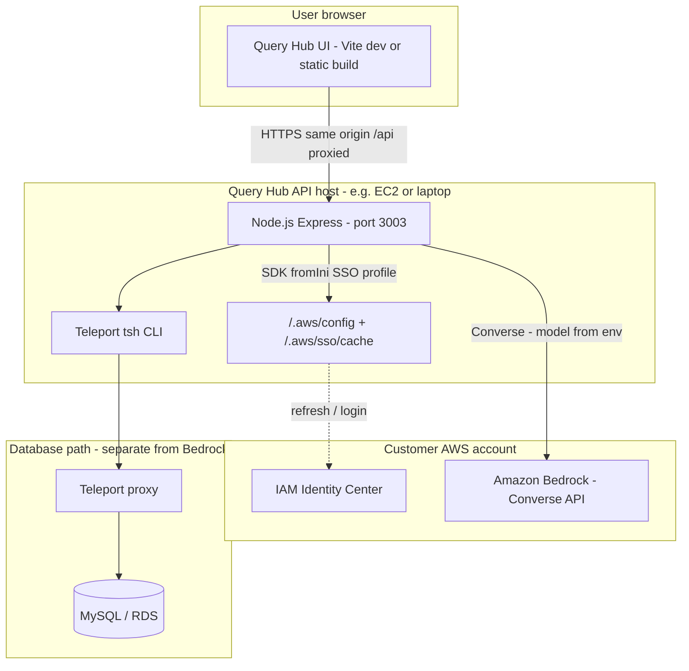
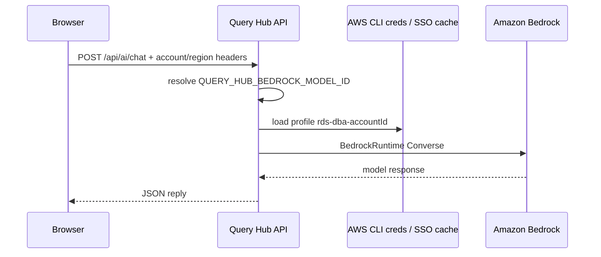

# Query Hub

Internal **DBA query workspace**: connect to MySQL through **Teleport** (`tsh`), run **guarded SQL**, **EXPLAIN**, browse **schema** (tables, views, routines, **scheduled events**, **ER diagram** from foreign keys), **workspace tabs**, **history / saved queries**, **CSV export**, and optional **Kiro** (assistant backed by **Amazon Bedrock** + **AWS CLI SSO** on the API host — same `aws sso login --profile` idea as RDS Replica Lag). Personal third-party API keys are not stored in the browser.

## Platforms: Windows and macOS

Query Hub is **supported on both Windows and macOS** (and Linux). The stack is **Node.js + npm** only; there is no Windows-only or Mac-only code path in the app itself.

| Concern | Windows | macOS |
|---------|---------|--------|
| **Install** | PowerShell or CMD; paths use `\` | Terminal; paths use `/` |
| **`tsh` / Teleport** | Install from Teleport docs or org installer; ensure `tsh` is on **PATH** | `brew install teleport` or Teleport Connect |
| **AWS CLI** | Installer from AWS; SSO cache under user profile | Same; `~/.aws/` |
| **Teleport profiles** | `%USERPROFILE%\.tsh\` | `~/.tsh/` |
| **Run dev** | `npm run dev` from `server\src\tools\query-hub` | Same command from `server/src/tools/query-hub` |
| **Browser** | http://localhost:5180 | Same |

**Rule of thumb:** whatever machine runs **`npm run dev`** for Query Hub is the **API host** — that machine must have **`tsh`** (and AWS CLI if you use Kiro) installed and logged in. If you only open the UI in a browser on another laptop while the API runs on a jump host, put `tsh` and AWS on the **jump host**, not necessarily on the laptop.

---

## Prerequisites

| Requirement | Why |
|-------------|-----|
| **Node.js 18+** and **npm** | Build & run client + API (installs **Mermaid** in the client workspace for the in-app **ER diagram** viewer) |
| **Teleport CLI `tsh`** on the **same machine that runs the Query Hub API** | Cluster list comes from `~/.tsh/*.yaml` on that host; tunnels run there too |
| **Teleport login** (`tsh login <proxy>`) on that machine | So profiles exist and SSO works |
| **AWS CLI v2** on the API host | **Kiro**: list accounts + SSO login + Bedrock — same SSO session pattern as RDS Replica Lag; role needs `bedrock:Converse` (and model access in AWS) |
| **Network** to your Teleport proxy / RDS (as usual for `tsh db`) | Same as any Teleport DB workflow |

> **Important:** The browser only talks to the Query Hub UI. **Clusters and `tsh` are resolved on the API server** (default port **3003**), not magically from your laptop unless the API runs on your laptop.

---

## Architecture (for security reviews / AWS Support)

There is no separate image file in the repo; **copy the diagrams below** into tickets (GitHub/GitLab and many AWS Support cases render Mermaid) or export from the [Mermaid Live Editor](https://mermaid.live).

**Summary:** The browser only talks to the **Query Hub API** (`/api/*`). **Teleport `tsh`** and **AWS CLI / SSO profiles** run on the **same host as the API** (e.g. EC2 or your laptop). **Kiro** uses **Amazon Bedrock**: the model ID is **`QUERY_HUB_BEDROCK_MODEL_ID`** on the server; credentials are **AWS SSO** (`rds-dba-<accountId>` or equivalent) via shared credentials / SSO cache on the API host.



**Kiro / Bedrock only (SQL data path is separate):**



**Related (other tool, same SSO pattern):** `server/src/tools/rds-replica-lag/ARCHITECTURE.md` — Replica Lag metrics tool has more detailed internal docs; endpoints are **not** 1:1 with Query Hub.

---

## Install (one-time) — Windows and macOS

### 1. Get the code

Clone or pull the **EDT Hub** monorepo and use the branch your team uses for Query Hub.

### 2. Install Node.js 18+

- Download **LTS** from [nodejs.org](https://nodejs.org/) (same installer family for Windows and Mac).
- Verify in a terminal:

```bash
node -v   # v18.x or newer
npm -v
```

### 3. Install Teleport CLI (`tsh`) on the API host

Query Hub’s backend runs **`tsh` on the machine where the API runs** (your laptop or a shared host).

| OS | Typical install |
|----|------------------|
| **Windows** | [Teleport installation docs](https://goteleport.com/docs/installation/) or org package; Teleport Connect often ships `tsh`. Add the folder containing `tsh.exe` to **PATH**, or set **`QUERY_HUB_TSH_PATH`** in `.env` to the full path (e.g. `C:\Program Files\Teleport Connect\resources\bin\tsh.exe`). |
| **macOS** | `brew install teleport`, or install Teleport Connect and ensure `tsh` is on PATH (e.g. `/usr/local/bin/tsh`). If not found, set **`QUERY_HUB_TSH_PATH`** to the binary (e.g. `/opt/homebrew/bin/tsh`). |

Check:

```bash
tsh version
```

### 4. Install npm dependencies and env file

Always run these commands from **`edt-hub/server/src/tools/query-hub`** (the folder that contains this README and the workspace `package.json`). **`npm install`** installs **server**, **client**, and client deps including **Mermaid** (ER diagram UI).

**Windows (PowerShell):**

```powershell
cd path\to\edt-hub\server\src\tools\query-hub
npm install
Copy-Item .env.example .env
```

**macOS / Linux:**

```bash
cd /path/to/edt-hub/server/src/tools/query-hub
npm install
cp .env.example .env
```

Edit **`.env`** as needed (see [Environment variables](#environment-variables-api--env) below). For **Kiro / Bedrock**, set **`QUERY_HUB_BEDROCK_MODEL_ID`**. **Restart the API** after any `.env` change.

**Optional — AWS CLI on the API host** (only if you use Kiro): install [AWS CLI v2](https://docs.aws.amazon.com/cli/latest/userguide/getting-started-install.html) on the same machine as the API and complete SSO login when prompted by the app.

---

## Run locally (every day)

From **`server/src/tools/query-hub`**:

```bash
npm run dev
```

(Command is the same on Windows, macOS, and Linux.)

This starts **both** workspaces via `concurrently`:

| Service | URL / port |
|---------|------------|
| **Web UI** (Vite) | http://localhost:5180 |
| **API** (Express) | http://localhost:3003 |

The UI proxies **`/api/*`** to the API in dev — use **http://localhost:5180** in the browser, not 3003 for normal use.

**Sanity checks**

- Open **http://localhost:5180** — Query Hub loads.
- Open **http://localhost:3003/api/health** — JSON like `{ "status": "ok", ... }`.

**Stop:** **Ctrl+C** in the terminal (Windows and Mac). That helps tear down Teleport DB tunnels cleanly.

**Ports busy?** Set **`PORT=`** in `.env` for the API, and point Vite at it: **`client/vite.config.ts`** → `server.proxy` target. If you change the UI port (**`client/vite.config.ts`** `server.port`), update the EDT Hub **`tools-registry`** iframe URL for Query Hub.

### Production build (optional)

From **`server/src/tools/query-hub`**:

```bash
npm run build
```

This runs **`npm run build`** in **server** then **client**. Serve the API with `node` (or your process manager) from the server build output; serve the client **`client/dist`** as static files and reverse-proxy **`/api`** to the API, or run the API and configure the client’s production API base URL per your deployment docs.

---

## How to use (step by step)

### 1. Teleport on the API host

On the machine where **`npm run dev`** (or your deployed API) runs:

```bash
tsh version
tsh login your-cluster.teleport.example
```

After login, profile files appear under:

- **Windows:** `%USERPROFILE%\.tsh\` (e.g. `C:\Users\<you>\.tsh\`)
- **macOS / Linux:** `~/.tsh/`

### 2. Start the app

1. From **`server/src/tools/query-hub`**, run **`npm run dev`**.
2. In your browser, open **http://localhost:5180** (the Vite dev server proxies **`/api`** to port **3003** — you normally do not open 3003 for the UI).

### 3. Sidebar → **Connection**

1. **“No Teleport clusters found”** — run **`tsh login`** on the API host, then **Refresh clusters**.
2. **“tsh not found on the API server”** — install `tsh` on the API host and ensure it is on **PATH**, or set **`QUERY_HUB_TSH_PATH`** in `.env` to the full path to **`tsh`** (Windows: `tsh.exe`).
3. **“Could not load cluster list” / HTTP 500** — confirm **http://localhost:3003/api/health** responds; if not, the UI proxy has nothing to reach (start **`npm run dev`** from `query-hub`, or fix **`PORT`** / Vite proxy).
4. Pick **Cluster** → **Login via SSO** if needed → pick **MySQL instance** → wait until status shows **Connected** and databases load.

### 4. Main workspace

1. Choose **Active database** (header or connection area, depending on layout).
2. Write SQL in the editor. **Run:** **Ctrl+Enter** (Windows/Linux) or **Cmd+Enter** (macOS).
3. Use **EXPLAIN**, **Export CSV**, and **Save** as needed.

**Workspace tabs (header)**

- **+ Tab** — new workspace (separate SQL, results, and **query history** per tab).
- **+ Clone** — duplicate the current tab (connection + editor/results snapshot).
- **×** closes a tab (at least one tab remains).
- The API keeps **one live MySQL session** at a time; **switching tabs** reconnects to that tab’s saved instance.

### 5. Schema browser (header → **Schema**)

Opens a panel for the **currently selected database** (use the database dropdown in the panel to match your context).

| Section | What it shows |
|---------|----------------|
| **Tables / Views** | Expand **▶** on a row to load **columns** from the server. |
| **Stored procedures / Functions** | Name + quick actions. |
| **Events** | MySQL **scheduled events** (name, status, schedule summary) when `information_schema.EVENTS` is available. |

**Row actions**

| Button | Behavior |
|--------|-----------|
| **Sel** (tables) | Replaces editor with `SELECT * FROM \`table\` LIMIT 100` and closes the schema popover. |
| **Call** / **Sel** (routines) | Inserts a **CALL** or **SELECT routine()** template. |
| **DDL** | Opens a modal with **SHOW CREATE** output (table, view, procedure, function, or event). **Copy DDL** / **Send to editor** in the modal. |
| **Ins** | Inserts the **backtick-quoted object name** at the **current cursor** in the SQL editor (works across iframe boundaries; no clipboard required). |
| **Refs** | Opens a **References** modal: **tables** and **views** separately for views and routines; for **events**, also **stored routines** detected via **`CALL`** and backtick names. Click a name to insert it at the cursor. The button may show a count when something was detected. |

**Object dependencies (Refs)**

- Loaded with the schema via **`GET /api/schema/object-dependencies?db=…`** (response groups **tables** vs **views**; events add **routines**).
- **Views** / **routines**: **MySQL 8.0.13+** prefers **`VIEW_TABLE_USAGE`** and **`ROUTINE_TABLE_USAGE`**; otherwise definitions are parsed for backtick identifiers.
- **Events**: **`CALL …(`** targets plus backtick identifiers matched to procedures/functions in the schema; tables/views split by type.

**ER diagram**

- Click **ER diagram** in the schema panel to open a modal.
- **Foreign keys** are loaded from **`GET /api/schema/foreign-keys?db=…`** (`information_schema`). The graph is rendered with **Mermaid** in the browser.
- **Scheduled events** are listed **below** the graph (MySQL does not model FK relationships for events).
- **Copy Mermaid** copies the diagram source (e.g. for [Mermaid Live Editor](https://mermaid.live) or docs). Large schemas may show only the first **200** FK column references (see on-screen note).

Each time you **open** the Schema popover from the header, the explorer **remounts** with all groups **expanded** by default. Changing the **database** dropdown inside the panel also **re-expands** all groups.

### 6. Sidebar → **History & saved**

Click a row to load that SQL into the editor.

### 7. **Kiro** (optional)

1. Set **`QUERY_HUB_BEDROCK_MODEL_ID`** in `.env` (org-approved model — not entered in the browser).
2. **Same path as RDS Replica Lag (recommended):** pick a **MySQL instance** in Teleport (so account + region come from `tsh db ls`). Open **Kiro** → **Connection** → **Sign in with AWS SSO (Replica Lag style)** — this calls **`POST /api/ai/aws-sso-login`** with that account/region and runs **`aws sso login --profile rds-dba-<accountId>`** on the API host (browser may open there). Use **Refresh role session** if Bedrock calls fail.
3. **Fallback:** if your DB labels have no AWS account/region, expand **Advanced** and use **Sign in to AWS** (device-code flow like the main EDT Hub: `sso-status` / `sso-login` / `sso-login-info`; profile **`QUERY_HUB_SSO_DEVICE_PROFILE`** or `default`) and pick account + region manually.
4. Use **Ask** / **Explain SQL** / **Optimize** / **Generate**, or **Kiro** actions on the results toolbar.

**Headless / CI:** you can omit the account picker by setting **`QUERY_HUB_BEDROCK_PROFILE`** (or `AWS_PROFILE`) and **`QUERY_HUB_BEDROCK_MODEL_ID`** on the server only.

---

## Using inside EDT Hub (iframe)

The main hub can load Query Hub in an iframe at **http://localhost:5180**.

1. Start Query Hub **`npm run dev`** first.
2. Open EDT Hub and select the **Query Hub** tool.

If the iframe is blank, confirm **5180** is free and the dev server is running.

---

## Environment variables (API / `.env`)

| Variable | Required | Notes |
|----------|----------|--------|
| `PORT` | No | API port (default **3003**) |
| `QUERY_HUB_SSO_DEVICE_PROFILE` | No | Profile for initial SSO (`aws sso login --profile …`); default **`default`** (match main hub) |
| `AWS_SSO_START_URL` | No | **EC2 / API host:** IAM Identity Center portal URL if `~/.aws/config` has no `sso-session` (or to override). Use quotes if the URL contains `#` (see `.env.example`). Fragment is stripped before writing profiles. |
| `AWS_SSO_REGION` | No | SSO region for `aws sso list-account-roles` (default **us-east-1** or from config) |
| `QUERY_HUB_TSH_PATH` | No | Full path to `tsh` if not on `PATH` (same machine as API) |
| `QUERY_HUB_USE_KIRO_CLI` | No | Set **`true`** to use **only** **AWS Kiro CLI** on the API host. No **`QUERY_HUB_BEDROCK_MODEL_ID`**. |
| *(default)* | — | If **`QUERY_HUB_BEDROCK_MODEL_ID`** is **unset** and **`QUERY_HUB_USE_KIRO_CLI`** is not `true`, the API **tries Kiro CLI first** (workaround for users with Kiro access but no Bedrock IAM). |
| `QUERY_HUB_DISABLE_KIRO_CLI_FALLBACK` | No | Set **`true`** to skip that auto Kiro CLI attempt and require Bedrock env vars instead. |
| `QUERY_HUB_KIRO_CLI_PATH` | No | Path to `kiro-cli` if not on `PATH` (same machine as API). |
| `QUERY_HUB_KIRO_WORKDIR` | No | Working directory for Kiro session files (default: `%TEMP%/query-hub-kiro-sessions` or `/tmp/...`). |
| `QUERY_HUB_KIRO_CLI_TIMEOUT_MS` | No | Per-request timeout (default **180000** ms). |
| `QUERY_HUB_BEDROCK_MODEL_ID` | **Yes (Bedrock mode)** | Inference profile ID or model ID from Bedrock when **`QUERY_HUB_USE_KIRO_CLI`** is not `true`. |
| `QUERY_HUB_BEDROCK_ACCOUNT_ID` | No | **Split-account setup:** 12-digit AWS account where Bedrock is enabled (e.g. **par-ai non-prod**) when it differs from the Teleport RDS account. Forces `rds-dba-<this id>` for Kiro only. |
| `QUERY_HUB_BEDROCK_PROFILE` | No | Headless: SSO profile name when not using account picker |
| `QUERY_HUB_BEDROCK_REGION` | No | Default region when using headless profile |
| `AWS_PROFILE` | No | Alternative to `QUERY_HUB_BEDROCK_PROFILE` for headless |
| `QUERY_HUB_EMAIL_AUTH` | No | Optional legacy email OTP API (not used by Kiro UI) |
| `QUERY_HUB_JWT_SECRET` | If email auth | Strong secret for session tokens |
| `QUERY_HUB_EMAIL_DOMAIN` | If email auth | e.g. `partech.com` |
| `QUERY_HUB_ALLOWED_EMAILS` | Alt. | Comma-separated emails |
| `QUERY_HUB_EMAIL_LOG_CODES` | No | Log OTP to API console in prod (dev logs by default) |

See **`.env.example`** in this folder.

### Client `.env` (optional — `client/` next to Vite)

Use when the **browser UI** runs on your laptop but the **API + `kiro-cli`** run on **dba-kiro** (or any remote host).

| Variable | Notes |
|----------|--------|
| `VITE_DEV_API_PROXY_TARGET` | Dev only: Vite proxies `/api` here (default **`http://localhost:3003`**). After e.g. `tsh ssh -L 3003:127.0.0.1:3003 user@dba-kiro`, keep **`http://localhost:3003`**. For other tunnels, set accordingly. |
| `VITE_TELEPORT_KIRO_HOST_URL` | Teleport **web** URL to open **dba-kiro** (pinned resource, SSH connect page, etc.). Enables the **Connect to Kiro host (Teleport)** button in Kiro → Connection when the API uses **Kiro CLI** mode. |

Copy **`client/.env.example`** → **`client/.env`** if you use these.

---

## Troubleshooting (share this with teammates)

| Symptom | What to check |
|---------|----------------|
| Cluster dropdown only shows “Select a cluster…” | On the **API host**: `tsh login …` then **Refresh clusters** in the UI. Confirm `~/.tsh` (or Windows profile `.tsh`) has `*.yaml` profiles. |
| “Could not load cluster list” + Retry | API not running (**3003**), or Vite not proxying `/api` — use **`npm run dev`** from `query-hub` root (starts both). |
| `tsh` not found | Install Teleport CLI on the machine running the **Query Hub server**. On **Mac**, Homebrew’s `tsh` is often `/opt/homebrew/bin/tsh` or `/usr/local/bin/tsh` — if the API process does not inherit your shell PATH (e.g. launched from GUI), set **`QUERY_HUB_TSH_PATH`** explicitly. Same idea on **Windows** with the full path to **`tsh.exe`**. |
| ER diagram empty / error | Requires FK metadata in **`information_schema`** and privileges to read it. Events appear as a **list** only (no edges). Try **Copy Mermaid** if the SVG fails to render. |
| **Refs** modal empty / sparse | Older MySQL may lack **`VIEW_TABLE_USAGE`** / **`ROUTINE_TABLE_USAGE`**; fallback uses backtick names in definitions. Events also use **`CALL name(`** detection for procedures/functions; unquoted table names may be missing. Check **`information_schema`** privileges. |
| **Login via SSO** does nothing / stuck | SSO opens on the **API host**. Unread `tsh login` stdout/stderr pipes could block the child — fixed server-side (`stdio: ignore`); restart API. If still broken, run `tsh login` with your cluster on that host manually. |
| Kiro: “Failed to load accounts” / SSO errors | On the **API host**: run `aws sso login` (or complete **Sign in with AWS SSO** from Kiro). Ensure `QUERY_HUB_BEDROCK_MODEL_ID` is set in `.env`. |
| “AWS SSO start URL not found” on EC2 | Set **`AWS_SSO_START_URL`** (and optionally **`AWS_SSO_REGION`**) in **`query-hub/.env`** to your org portal (quoted if it has `#`), then restart the API — same idea as main EDT Hub / Replica Lag. |
| Kiro returns **503** | Missing **`QUERY_HUB_BEDROCK_MODEL_ID`**, or no account selected in Connection, or SSO profile/role cannot call Bedrock — check IAM and model access in AWS. |
| Bedrock only in **par-ai non-prod** but DB is in another account | Set **`QUERY_HUB_BEDROCK_ACCOUNT_ID`** to the par-ai non-prod **account ID**, **`QUERY_HUB_BEDROCK_MODEL_ID`** to the inference profile from that account, then on the API host run **Sign in with AWS SSO (Replica Lag style)** once — it will target **`rds-dba-<par-ai account>`** (same SSO portal). Ask Colin for exact account ID + profile ID. |
| SQL blocked | **SQL guard** blocks DDL, dangerous DML, etc. — adjust query or ask the team for policy. |

---

## Development commands

```powershell
cd server\src\tools\query-hub
npm run dev          # API + UI
npm run build        # Production build
npx -w client tsc --noEmit
npx -w server tsc --noEmit
```

---

## Repo location in EDT Hub

```
edt-hub/server/src/tools/query-hub/
├── client/              # Vite + React UI (includes Mermaid for ER diagram)
├── server/              # Express API (schema routes: tables, columns, routines, events, ddl, foreign-keys, …)
├── .memory/             # Tool-local session handover (for devs / AI — see HANDOVER.md inside)
├── package.json         # npm workspaces: client + server
├── .env.example
└── README.md            # this file
```

More internal detail: repo root **`CLAUDE.md`**, and **`ARCHITECTURE.md`** in this folder when present. **Session handover** for this tool only: **`.memory/HANDOVER.md`** (repo root **`.memory/`** is EDT-wide workflow, not tool internals).

### Notable API routes (for integrators)

| Method | Path | Purpose |
|--------|------|---------|
| GET | `/api/health` | Liveness |
| … | `/api/teleport/*` | Cluster / DB connection |
| GET | `/api/schema/tables?db=` | Table list |
| GET | `/api/schema/columns?db=&table=` | Column list |
| GET | `/api/schema/routines?db=` | Procedures & functions |
| GET | `/api/schema/events?db=` | Scheduled events |
| GET | `/api/schema/foreign-keys?db=` | FK edges for ER diagram |
| GET | `/api/schema/object-dependencies?db=` | `views`, `routines`, `events` — each entry has `tables` + `views` arrays; `events` also has `routines` |
| GET | `/api/schema/ddl?db=&name=&kind=` | `SHOW CREATE` (kinds: table, view, procedure, function, event) |
| … | `/api/query/*` | Execute / explain / export |
| … | `/api/ai/*` | Kiro / Bedrock / SSO helpers |

---

*PAR Enterprise Data Team — internal tool. Do not expose the API to untrusted networks without proper auth and review.*
